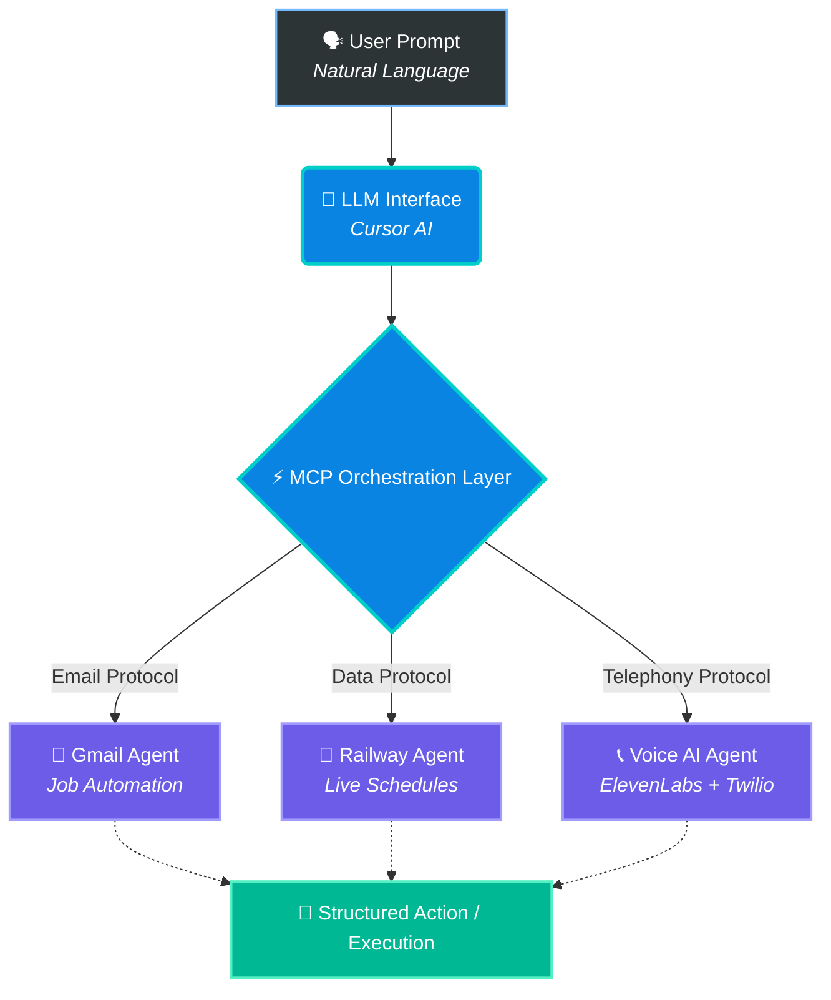

<h1>🤖 AI Multi-Agent Automation System</h1>

  <b>An enterprise-grade orchestration layer leveraging Model Context Protocol (MCP) to unify autonomous agents.</b>

  
  
  
  

---

## 🌌 The Vision

Instead of building isolated, brittle scripts, this system acts as a **Central AI Brain** capable of invoking, managing, and chaining multiple domain-specific agents in real-time. By leveraging the **Model Context Protocol (MCP)**, it bridges the gap between natural language reasoning and hard API executions.

> *"Talk to your infrastructure. Automate your reality."*

---

## ⚡ System Architecture

  

---

## 🤖 The Agents Matrix

<table align="center">
  <tr>
    <td align="center" width="33%">
      
      <h3>📧 Gmail Automation Agent</h3>
      
Autonomously drafts dynamic cover letters and executes high-volume job applications via MCP integration.

    </td>
    <td align="center" width="33%">
      
      <h3>🚆 Railway Data Agent</h3>
      
Hooks into live databases to fetch real-time train schedules, route insights, and dynamic seat availability.

    </td>
    <td align="center" width="33%">
      
      <h3>📞 Voice AI Agent</h3>
      
Fuses <b>ElevenLabs</b> neural text-to-speech with <b>Twilio</b> routing to deliver real-time, human-like voice calls.

    </td>
  </tr>
</table>

---

## 🛠️ The Tech Forge

| Infrastructure | Technology Stack | Purpose |
| :--- | :--- | :--- |
| **Brain** | `Cursor AI` | Natural Language Reasoning & LLM Orchestration |
| **Spine** | `Model Context Protocol (MCP)` | Standardized Agent-to-Server Communication |
| **Nerves** | `Pipedream` | Webhook Routing & Integration Layer |
| **Vocal Cords** | `ElevenLabs` & `Twilio` | Voice Synthesis and Telephony API |
| **Bloodstream** | `REST APIs` | External Data Fetching |

---

## 💡 Engineering Triumphs & Challenges

<b>View System Design Insights</b>

 

* 🛡️ **Problem:** Managing highly complex, asynchronous integrations.  
  * ✅ **Solution:** Engineered a deeply modular MCP server architecture, isolating failures and allowing plug-and-play scaling.
* 🛡️ **Problem:** Ambiguous natural language prompts causing API crashes.  
  * ✅ **Solution:** Implemented rigid prompt engineering structures that format chaotic human intent into strict JSON payloads.
* 🛡️ **Problem:** Hardcoded API vulnerability.  
  * ✅ **Solution:** Containerized environment-based credential injection.

---

## 🔮 Future Horizon

* 📊 **Telemetry:** Build a centralized React-based monitoring dashboard.
* 🧠 **Persistent Memory:** Introduce Vector DBs (e.g., Pinecone) so agents remember past interactions.
* 🔗 **Ecosystem Expansion:** Connect Slack, Notion, and GitHub webhooks into the MCP node.

---

  <h3>"Call me with the latest tech updates, and send my resume to Google HR."</h3>
  
<i>The system handles the rest.</i>

  

