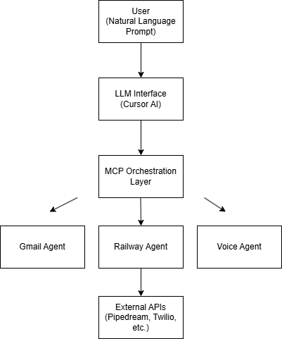

# 🚀 AI Multi-Agent Automation System (MCP-Based)

## 📌 Overview
This project implements a modular AI-driven automation system using Model Context Protocol (MCP) to integrate multiple real-world services into a unified intelligent workflow.

It enables natural language interaction with external tools such as email systems, voice AI, and real-time data services through LLM-powered orchestration.

---

## 🧠 Core Idea

Instead of building isolated automations, this system acts as a **central AI orchestrator** capable of invoking multiple domain-specific agents.

---

## ⚙️ System Architecture

User Prompt (Natural Language)
        ↓
LLM Interface (Cursor AI)
        ↓
MCP Orchestration Layer
        ↓
----------------------------------
|     External AI Agents         |
|-------------------------------|
| Gmail Agent (Email Automation)|
| Railway Agent (Data Retrieval)|
| Voice Agent (AI Calling)      |
----------------------------------
        ↓
API Responses → Structured Output

---

## 🤖 Agents Implemented

### 📧 Gmail Automation Agent
- Automates job applications using LinkedIn data
- Generates dynamic cover letters
- Sends emails via MCP integration

---

### 🚆 Railway Data Agent
- Fetches train schedules and live status
- Handles seat availability queries
- Provides route-based insights

---

### 📞 Voice AI Agent
- Uses ElevenLabs + Twilio for conversational AI calls
- Delivers real-time voice updates
- Simulates human-like interactions

---

## 🛠️ Tech Stack

- Cursor AI (LLM Interface)
- Model Context Protocol (MCP)
- Pipedream (Integration Layer)
- Twilio (Telephony API)
- ElevenLabs (Voice AI)
- REST APIs

---

## 💡 Key Engineering Concepts

- Multi-agent system design
- LLM orchestration and tool usage
- API integration and chaining
- Prompt engineering for automation workflows
- Modular architecture using MCP servers

---

## ⚡ Challenges & Solutions

**Problem:** Managing multiple integrations  
**Solution:** Designed modular MCP server architecture  

**Problem:** Ambiguous prompts  
**Solution:** Structured prompt engineering for clarity  

**Problem:** API security  
**Solution:** Used environment-based configurations  

---

## 🔮 Future Improvements

- Add centralized logging
- Introduce memory for agents
- Build monitoring dashboard
- Expand integrations (Slack, Notion, etc.)

---

## 📌 Example Use Cases

- "send my resume to XYZ@googlehr.com via email"
- "Get train schedules between two cities"
- "Call me with latest tech updates"

---

## 🧪 Demo

Refer to `/demos/demo_queries.md` for sample prompts and outputs.

---

## ⚠️ Note

This project focuses on **system design, integration, and orchestration of AI agents**, rather than standalone model training.

---

## 👨‍💻 Author

Built as part of an exploration into AI systems, agent-based design, and real-world automation.
